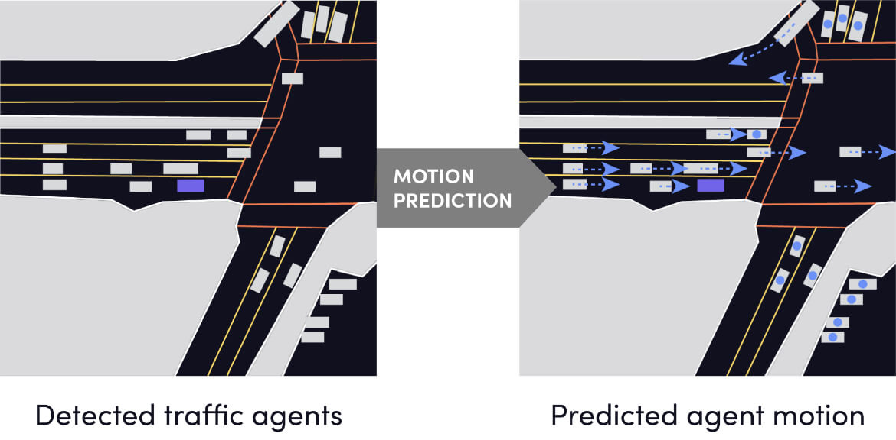

# lyft-motion-prediction-for-autonomous-vehicle

<p align="center">
  
</p>
<p align="center">
  
</p>

### Description
Build motion prediction models for self-driving vehicles to predict other car/cyclist/pedestrian (called "agent")'s motion.

> The image from L5Kit official document: http://www.l5kit.org/README.html <br/>
> Lyft official page: https://self-driving.lyft.com/level5/prediction/

### Table of Contents

- [Environment Setup](#environment-setup)
- [Model](./model)
- [Training](#training)
- [Prediction](#prediction)

### Environment Setup
- Python 3.* is installed
- Set permission
```
chmod 700 bin/bootstrap
```
- Run the bootstrap for installing the requirements
```
bin/bootstrap
```

### Dataset
Dataset is not present in this repo, please download the **Lyft Level 5 Prediction Dataset kit** from the [official website](https://self-driving.lyft.com/level5/data/), and cite the following in your work:
```
@misc{lyft2020,
  title = {One Thousand and One Hours: Self-driving Motion Prediction Dataset},
  author = {Houston, J. and Zuidhof, G. and Bergamini, L. and Ye, Y. and Jain, A. and Omari, S. and Iglovikov, V. and Ondruska, P.},
  year = {2020},
  howpublished = {\url{https://level5.lyft.com/dataset/}}
}
```
Unzip the the dataset into the folder `dataset/`.

### Training
- After installing all the requirements, run the following command for trainig
```
python train.py -d -gpu -model MODEL_NAME
```
- `-d`: debug mode, default is `False`
- `-gpu`: train on GPU, default is on `CPU`
- `model`: REQURIED, all the available models are in the folder `model/`, simply input the name of the model file.<br /> (eg. `-model baseline` for model `baseline.py`)

### Prediction

